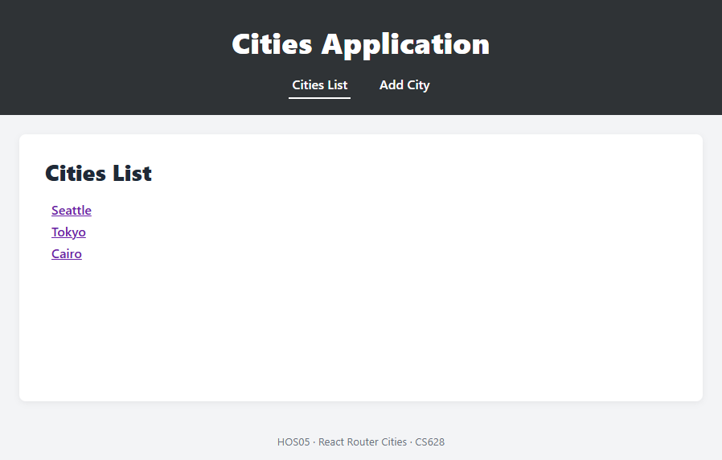
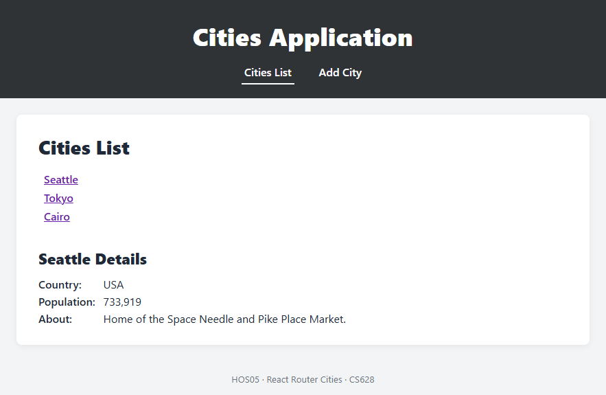
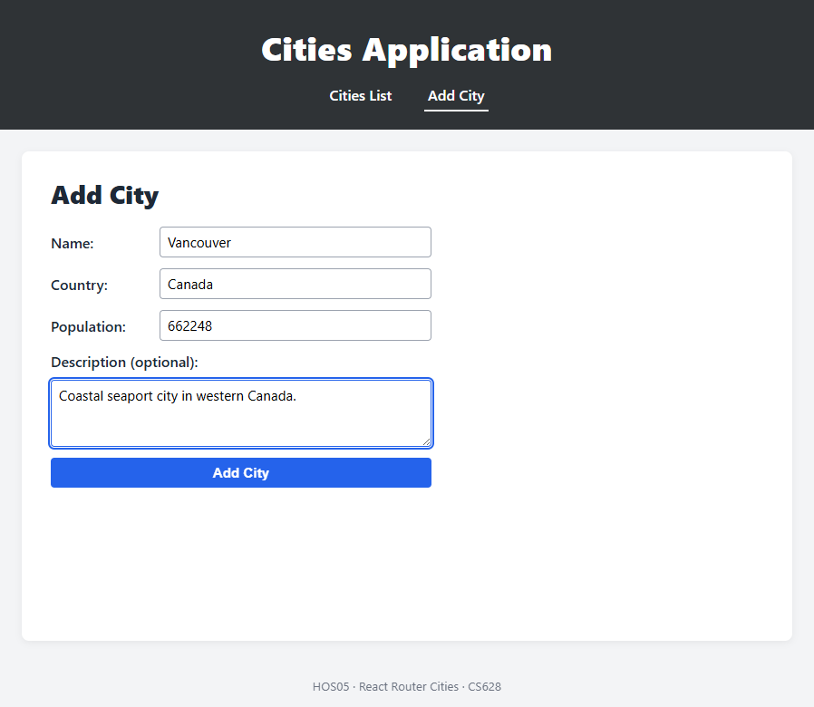
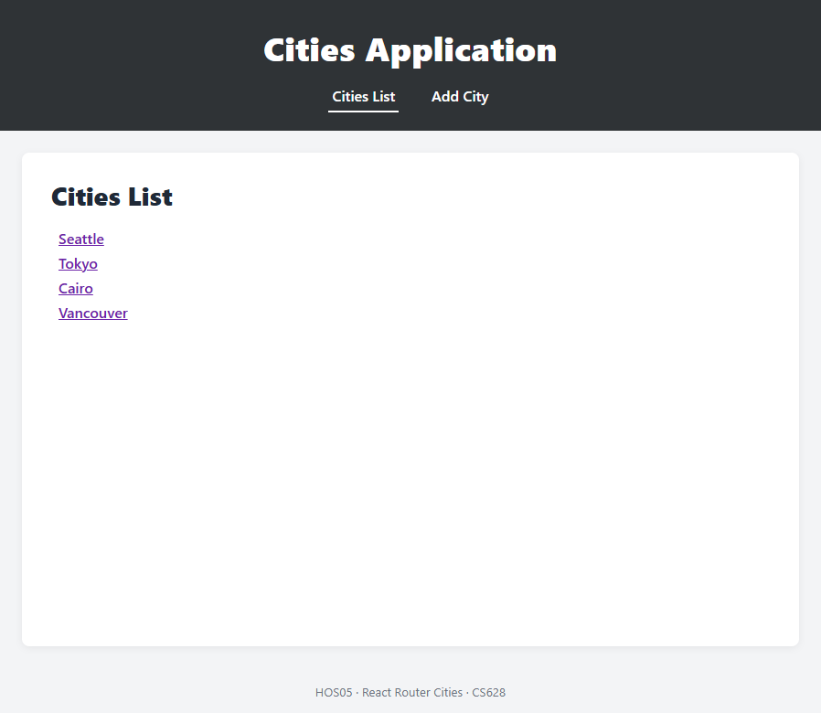

# Cities Application — HOS05

A small but production-quality React + TypeScript SPA built with **Vite** and
**React Router v7**. It satisfies every requirement of the CS628 HOS05
hands-on assignment:

| Requirement | How it is met |
|---|---|
| Cities List route with clickable city links | [`src/components/CitiesList.tsx`](src/components/CitiesList.tsx) |
| Add City route (name, country, population, optional description) | [`src/components/AddCity.tsx`](src/components/AddCity.tsx) |
| **Nested** City Details route under Cities List using `useParams` | [`src/components/CityDetails.tsx`](src/components/CityDetails.tsx) renders inside the `<Outlet />` of the list page |
| Redirect after Add City → Cities List | `useNavigate('/cities', { replace: true })` in [`AddCity.tsx`](src/components/AddCity.tsx) |
| React Router for all navigation | Route table in [`src/App.tsx`](src/App.tsx) |
| Custom styling (matches mock-ups) | [`src/styles.css`](src/styles.css) |
| Structured component organization | `src/components/`, `src/useCities.ts`, `src/CitiesProvider.tsx` |

## Screenshots

### 1. Cities List (default landing page)


### 2. City Details rendered *inside* the Cities List page (nested route)
URL: `/cities/1` — the list and the detail panel coexist on the same layout.


### 3. Add City form with validation


### 4. After submitting, the user is redirected to the Cities List with the new city


## Project structure

```
cities-app/
├── src/
│   ├── App.tsx                 # Route table (BrowserRouter children)
│   ├── main.tsx                # Entry point: BrowserRouter + CitiesProvider
│   ├── CitiesProvider.tsx      # Provider component (owns state)
│   ├── useCities.ts            # Context + useCities() hook
│   ├── seedCities.ts           # Initial demo data
│   ├── types.ts                # City / NewCity domain types
│   ├── styles.css              # Global styles
│   ├── components/
│   │   ├── Layout.tsx          # Header + nav + <Outlet/>
│   │   ├── CitiesList.tsx      # /cities — list + nested <Outlet/>
│   │   ├── CityDetails.tsx     # /cities/:cityId — uses useParams
│   │   ├── AddCity.tsx         # /add — form + useNavigate redirect
│   │   └── NotFound.tsx        # 404
│   └── test/
│       ├── setup.ts            # @testing-library/jest-dom matchers
│       └── App.test.tsx        # 6 integration tests (all routes + flows)
├── docs/screenshots/           # README screenshots
├── package.json
├── tsconfig*.json              # strict mode enabled
├── vite.config.ts              # Vite + Vitest config
└── eslint.config.js
```

## Routing

```
/            → <Navigate to="/cities" />
/cities      → CitiesList (Layout > CitiesList)
   /:cityId  →   CityDetails  (rendered inside CitiesList <Outlet/>)
/add         → AddCity
*            → NotFound
```

## Quality gates (all green)

| Tool | Command | Status |
|---|---|---|
| TypeScript (strict) | `npm run typecheck` | passes |
| ESLint | `npm run lint` | 0 errors / 0 warnings |
| Prettier | `npm run format:check` | clean |
| Vitest | `npm test` | **6 / 6 tests pass** |
| Vite production build | `npm run build` | succeeds |
| `npm audit` | — | **0 vulnerabilities** |

### What the tests cover
1. `/` redirects to `/cities` and seed cities render.
2. Clicking a city renders details *inside* the list page (nested route).
3. Unknown city id shows the friendly "City not found" warning.
4. The Add City flow saves and redirects back to the list.
5. Invalid population input is rejected with an inline error message.
6. Unknown URL path shows the 404 page.

## Run locally

```bash
cd cities-app
npm install
npm run dev          # http://localhost:5173
npm test             # run the test suite
npm run build        # production build into dist/
```

## Tech stack

- React 19 + TypeScript (strict)
- React Router DOM v7 (`BrowserRouter`, nested routes, `useParams`, `useNavigate`)
- Vite 8
- Vitest + @testing-library/react for tests
- ESLint + Prettier for code quality
