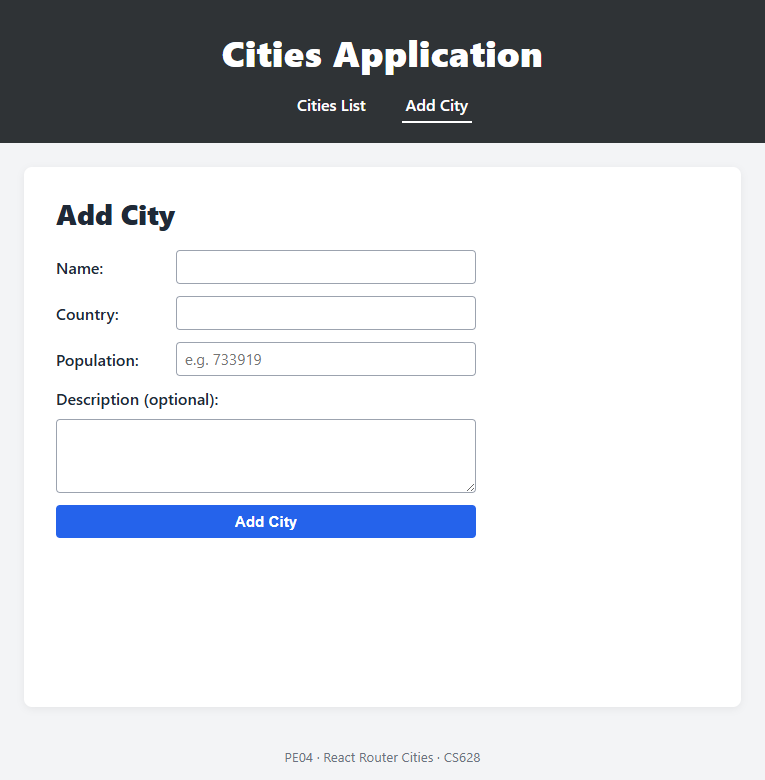
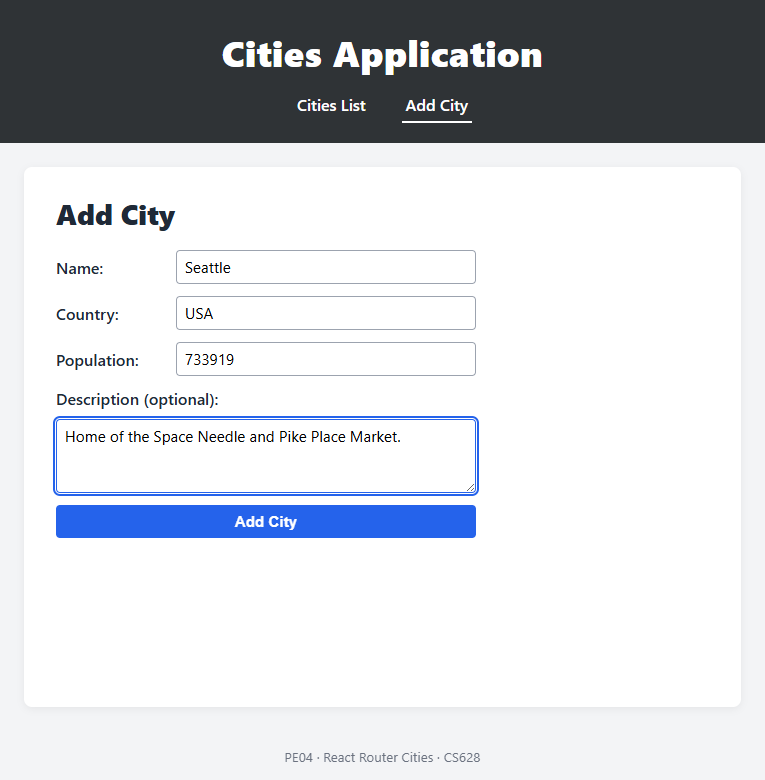

# Cities Application — PE04

A production-quality React + TypeScript SPA built with **Vite** and **React Router v7**.  
Satisfies every requirement of the CS628 PE04 hands-on assignment.

| Requirement | How it is met |
|---|---|
| Cities List route with clickable city links | [`src/components/CitiesList.tsx`](src/components/CitiesList.tsx) |
| Add City route (name, country, population, optional description) | [`src/components/AddCity.tsx`](src/components/AddCity.tsx) |
| **Nested** City Details using `useParams` — inside the list page | [`src/components/CityDetails.tsx`](src/components/CityDetails.tsx) via `<Outlet/>` |
| Redirect after Add City → Cities List | `useNavigate('/cities', { replace: true })` in AddCity |
| React Router for all navigation | Route table in [`src/App.tsx`](src/App.tsx) |
| Custom styling matching mock-ups | [`src/styles.css`](src/styles.css) |
| Structured component organisation | `src/components/`, `src/useCities.ts`, `src/CitiesProvider.tsx` |

---

## Screenshots

### 1. Cities List — Seattle only


---

### 2. Seattle City Details — nested inside the Cities List page
URL: `/cities/1` — the list and details coexist on the same layout via `<Outlet />`.


---

### 3. Add City — empty form


---

### 4. Add City — form filled with Seattle information


---

## Project structure

```
cities-app/
├── src/
│   ├── App.tsx                 # Route table
│   ├── main.tsx                # Entry: BrowserRouter + CitiesProvider
│   ├── CitiesProvider.tsx      # Provider (owns state)
│   ├── useCities.ts            # Context + useCities() hook
│   ├── seedCities.ts           # Seed data (Seattle)
│   ├── types.ts                # City / NewCity types
│   ├── styles.css              # Global styles
│   ├── components/
│   │   ├── Layout.tsx          # Header + nav + <Outlet/>
│   │   ├── CitiesList.tsx      # /cities — list + nested <Outlet/>
│   │   ├── CityDetails.tsx     # /cities/:cityId — useParams
│   │   ├── AddCity.tsx         # /add — form + redirect
│   │   └── NotFound.tsx        # 404
│   └── test/
│       ├── setup.ts
│       └── App.test.tsx        # 6 integration tests
├── docs/screenshots/
└── package.json
```

## Routing

```
/            → <Navigate to="/cities" />
/cities      → CitiesList
   /:cityId  →   CityDetails  (nested Outlet inside CitiesList)
/add         → AddCity
*            → NotFound (404)
```

## Quality gates — all green

| Tool | Command | Result |
|---|---|---|
| TypeScript strict | `npm run typecheck` | ✅ 0 errors |
| ESLint | `npm run lint` | ✅ 0 errors / 0 warnings |
| Prettier | `npm run format:check` | ✅ clean |
| Vitest | `npm test` | ✅ **6 / 6 tests pass** |
| Production build | `npm run build` | ✅ succeeds |
| npm audit | — | ✅ **0 vulnerabilities** |

### Tests cover
1. `/` redirects to `/cities` and Seattle renders
2. Clicking Seattle renders details *inside* the list page (nested route)
3. Unknown city id → friendly "City not found" warning
4. Add City saves and redirects back to the list
5. Invalid population → inline error, no redirect
6. Unknown URL → 404 page

## Run locally

```bash
cd cities-app
npm install
npm run dev      # http://localhost:5173
npm test         # run test suite
npm run build    # production build → dist/
```

## Tech stack

- React 19 + TypeScript (strict mode)
- React Router DOM v7 — `BrowserRouter`, nested routes, `useParams`, `useNavigate`
- Vite 8
- Vitest + @testing-library/react
- ESLint + Prettier
